# PART 1. Setup Environment

Please log into the AWS Management Console using the credentials provided to you on the separate card.

You will be using the `Ohio (US-EAST-2)` region.

In this part of the lab you will leverage AWS CloudFormation to provision an Aurora MySQL 5.6 compatible database cluster, along with a Linux EC2 instance to be used as a workstation. You will connect to the workstation using SSH.

The environment deployed using **CloudFormation** includes several components, as listed below. Please download the CloudFormation template (instructions below) and review it for more details.

1. Amazon VPC network configuration with public and private subnets
2. Database subnet group and relevant security groups for the cluster and workstation
3. Amazon EC2 instance configured with the software components needed for the lab
4. Roles with access permissions for the workstation and cluster permissions for enhanced monitoring, S3 access and logging
5. Custom cluster and DB instance parameter groups for the Amazon Aurora cluster, enabling logging and performance schema
6. Amazon Aurora DB cluster with 2 nodes: a writer and read replica
7. Read replica auto scaling configuration
8. AWS Systems Manager command document to execute a load test

## Task 1.1 Sign in to Management Console, Select Region and Create Key Pair

1. Login to your AWS Isengard console and ensure you select **Ohio (US-EAST-2)**region before you start.
2. Enter the **Username** and **Password** from the credentials card, click **Sign In**.
    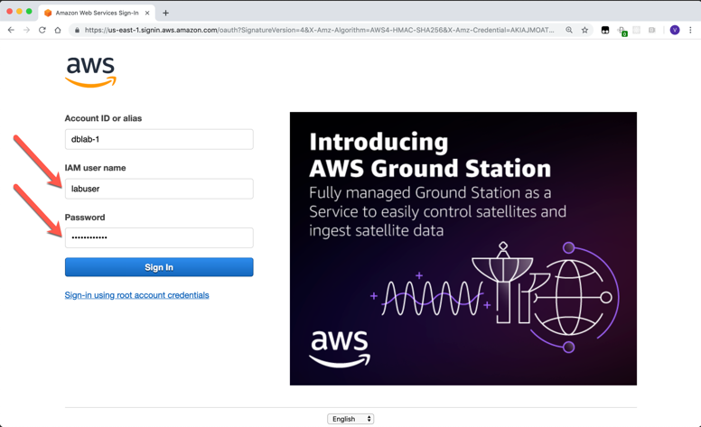

1. Ensure the **Ohio (us-east-2)** region is selected in the top right corner, if not use that dropdown to choose the correct region

    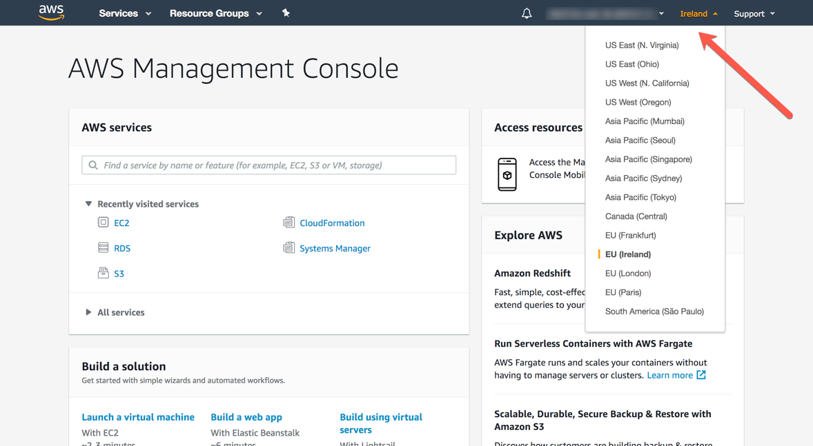

1. Open the **Key Pairs** section of the EC2 service console.
2. Ensure you are still in the correct region, and click **Create Key Pair**.


    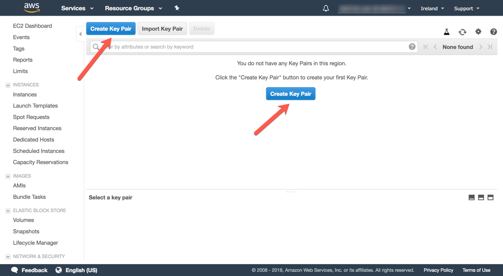

1. Name the key pair `dblabkeys` and then click **Create** and download the file named **dblabkeys.pem** to your computer, save it in a memorable location like your desktop.  You will need this file later in the lab.

    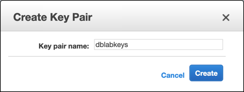

## Task 1.2 - Creating a Stack using CloudFormation

1. Download the CloudFormation template named [lab\_template.yml](https://raw.githubusercontent.com/czhc/aurora-deep-dive--private/master/lab1/lab_template.yml?token=ABDLDPLM6425NFSEY4H2GYC5ZCV26). Save it in a memorable location such as your desktop, you will need to reference it.

2. Open the **CloudFormation** service console and *Create Stack* 

    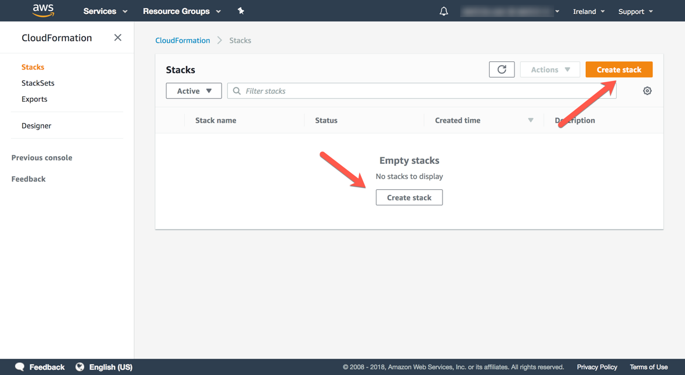

1. Select the radio button named **Upload a template** , then **Choose file** and select the template file you downloaded previously named [lab_template.yml](./lab_template.yml) and then click **Next**.

    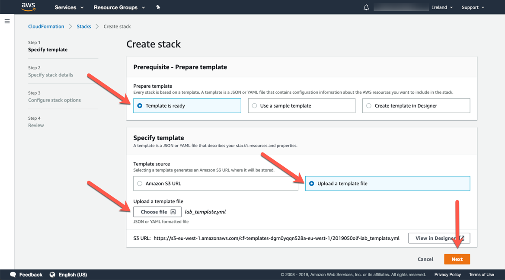

1. In the field named **Stack Name** , enter the value `dblabstack`, select the **ec2KeyPair** value as `dblabkeys` (the key pair you have created previously).

    Select all 3 AZs available in the drop down available for the **vpcAZs** field and then click **Next**.

    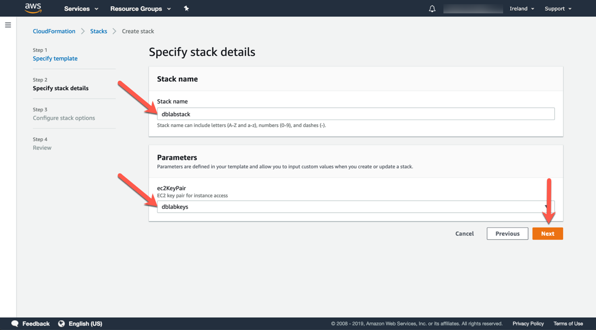

1. On the **Configure stack options** page, leave the defaults as they are, scroll to the bottom and click **Next**.


    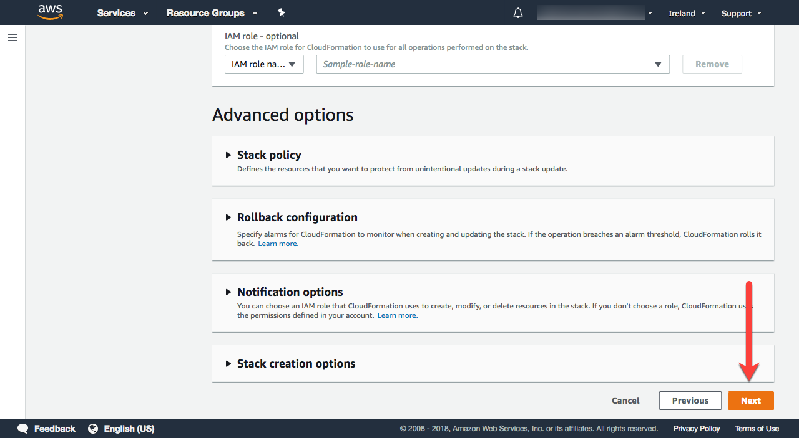

1. On the **Review dblabstack** page, scroll to the bottom, check the box that reads: **I acknowledge that AWS CloudFormation might create IAM resources with custom names** and then click **Create**.

    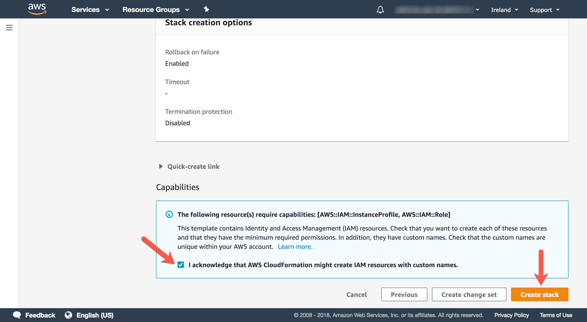

1. The stack will take approximatively 20 minutes to provision, you can monitor the status on the **Stack detail** page. You can monitor the progress of the stack creation process by refreshing the **Events** tab. 
    The latest event in the list will indicate **CREATE\_COMPLETE** for the **dblabstack** resource.

    In the meantime we will discuss some important considerations when architecting and automating the deployment of Aurora clusters.

    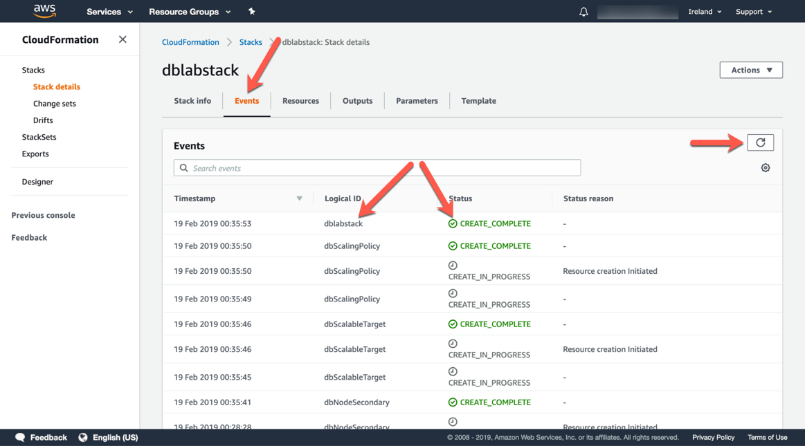


1. Once the status of the stack is _CREATE COMPLETE_ , click on the **Outputs** tab. The values here will be critical to the completion of the remainder of the lab.   
    
    **Please take a moment to save these values somewhere that you will have easy access to them during the remainder of the lab.** 
    
    The names that appear in the **Key** column are referenced directly in the instructions in subsequent steps, using the parameter format: **[outputKey]**

    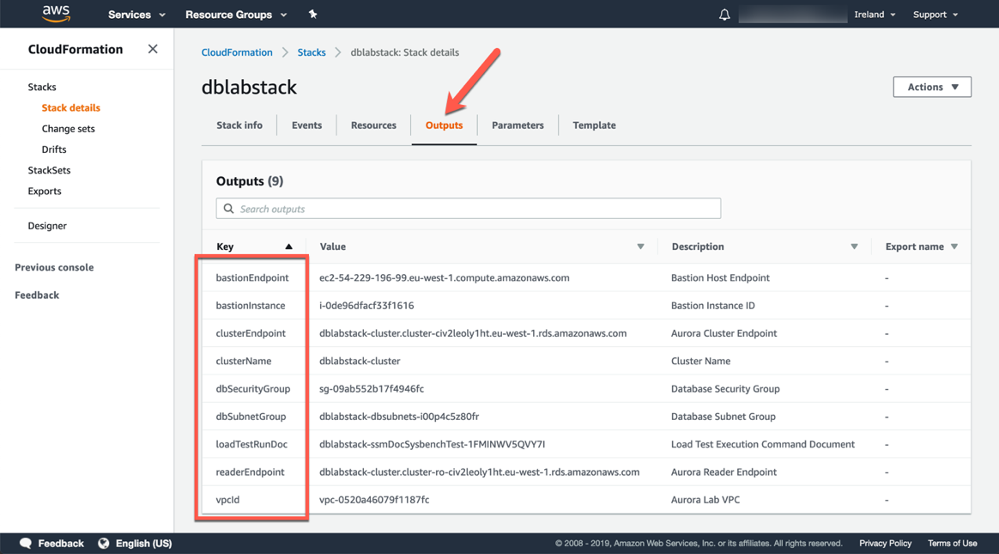


## Task 1.3 - Connecting to the workstation EC2 instance

**For Windows users:** We will use PuTTY and PuTTY Key Generator to connect to the workstation using SSH. If you do not have these applications already installed please use the steps in **Appendix 1 - Setting up PuTTY and connecting via SSH** below.

**For macOS or Linux users:** You can connect using the following command from a terminal, however you will need to change the permissions of the certificate file first:

```
  chmod 600 /path/to/.pem
  ssh -i /path/to/.pem ubuntu@[bastionEndpoint]

```


## Task 1.4 Set up the AWS CLI and seed the DB Cluster

1. Enter the following command in the SSH console to configure the AWS CLI:

    ```
      aws configure
    ```

    Then select the defaults for everything except the default region name.  For the default region name, enter `us-east-2`.
    Ignore the region listed in the screen shot below. The correct region to chose is `us-east-2`

    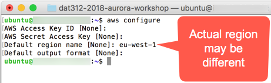

1. Connect to the Aurora database using the following command:

    ```
      mysql -h [clusterEndpoint] -u masteruser -p mylab
    ```
    
    **NOTE:** Unless otherwise specified the cluster master username is **masteruser** and the password is **Password1**

1. Run the following queries on the database server, they will create a table, and load data from S3 into it:

    ```
      DROP TABLE IF EXISTS `sbtest1`;

      CREATE TABLE `sbtest1` (
       `id` int(10) unsigned NOT NULL AUTO_INCREMENT,
       `k` int(10) unsigned NOT NULL DEFAULT '0',
       `c` char(120) NOT NULL DEFAULT '',
       `pad` char(60) NOT NULL DEFAULT '',
      PRIMARY KEY (`id`),
      KEY `k_1` (`k`)
      ) ENGINE=InnoDB DEFAULT CHARSET=latin1;

      LOAD DATA FROM S3 MANIFEST
      's3-us-west-2://auroraworkshopassets/data/sbtable/sample.manifest'
      REPLACE INTO TABLE sbtest1
      CHARACTER SET 'latin1';
      FIELDS TERMINATED BY ',';
      LINES TERMINATED BY '\r\n';

    ```
