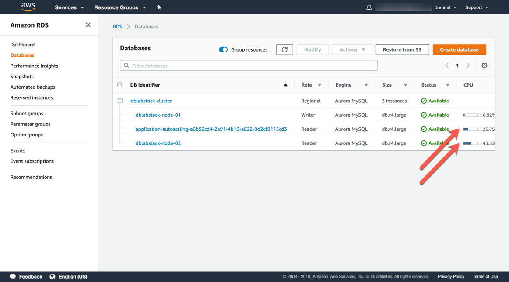

# PART 2. Cluster Endpoints and Auto Scaling

In this part we will explore the cluster endpoints and how auto scaling of read replicas operates.

## Task 2.1 – Running a read-only workload

1. On the bastion host, execute the following statement:

```
python loadtest.py[readerEndpoint]
```

1. Open the **Amazon RDS** service console
2. Take note that the reader node is currently receiving load. It may take a minute or more for the metrics to fully reflect the incoming load.


1. After a few minutes return to the list of instances and notice that a new reader is being provisioned to your cluster.


1. Once the replicas are added, note that the they are starting to receive load.



1. You can now type `CTRL+C` on the bastion host to end the read load, if you wish to. After a while the additional readers will be removed automatically.
