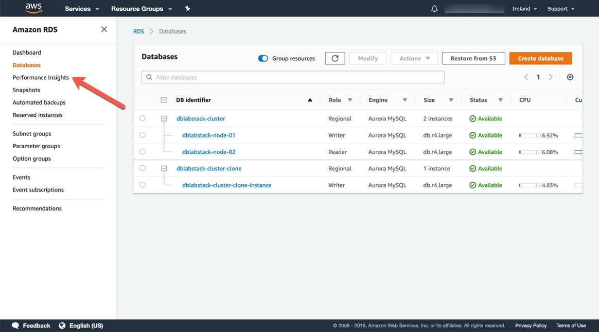
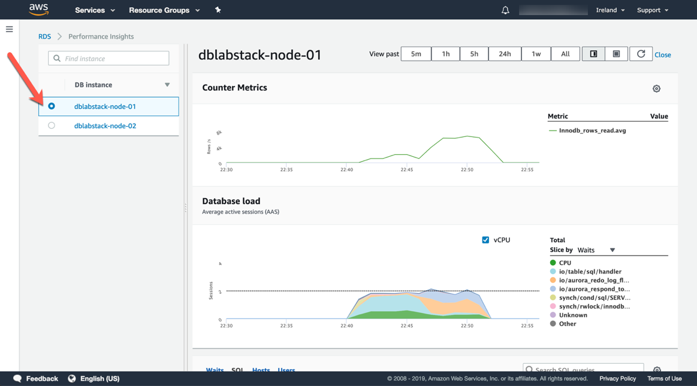

# PART 4. Performance Insights

## Task 4.1 – Generate Load on Your Database Cluster

1. You will use [Percona's TPCC-like benchmark script](https://github.com/Percona-Lab/sysbench-tpcc) based on sysbench to generate load. For simplicity we have packaged the correct set of commands in an AWS Systems Manager Command Document. You will use AWS Systems Manager Run Command to execute the test.
2. On the workstation host, execute the following statement:

```
aws ssm send-command --document-name [loadTestRunDoc] --instance-ids [bastionInstance]
```

1. The command will be sent to the workstation EC2 instance which will prepare the test data set and run the load test. It may take up to a minute for CloudWatch to reflect the additional load in the metrics.

1. Navigate to the RDS service console and click on **Performance Insights** in the left side navigation bar.




1. Examine the performance of your DB instance **demostack-node-01** using Performance Insights. What conclusions can you reach?




