# Part 5. Working with Aurora Serverless

## Task 5.1 Run CloudFormation Stack to create Cloud 9 IDE

S3 URL for Cloud Formation Template :

[https://aws-quickstart.s3.amazonaws.com/quickstart-cloud9-ide/templates/cloud9-ide-instance.yaml](https://aws-quickstart.s3.amazonaws.com/quickstart-cloud9-ide/templates/cloud9-ide-instance.yaml)

You will need to have public subnet id from the previous cloudformation template outputs section handy for this step.

[https://us-east-2.console.aws.amazon.com/cloudformation/home?region=us-east-2 - /stacks/create/template?stackName=AWS-Cloud9-IDE&amp;templateURL=https://aws-quickstart.s3.amazonaws.com/quickstart-cloud9-ide/templates/cloud9-ide-instance.yaml](https://us-east-2.console.aws.amazon.com/cloudformation/home?region=us-east-2#/stacks/create/template?stackName=AWS-Cloud9-IDE&amp;templateURL=https://aws-quickstart.s3.amazonaws.com/quickstart-cloud9-ide/templates/cloud9-ide-instance.yaml)


1. Go to the RDS Console and click on the &quot;Create Database&quot; orange icon.

    

1. In the next screen, please ensure that &quot;easy create&quot; is set to off, choose &quot;Amazon Aurora&quot; as Engine Options, and the Edition is &quot;Amazon Aurora with MySQL compatibility&quot;

    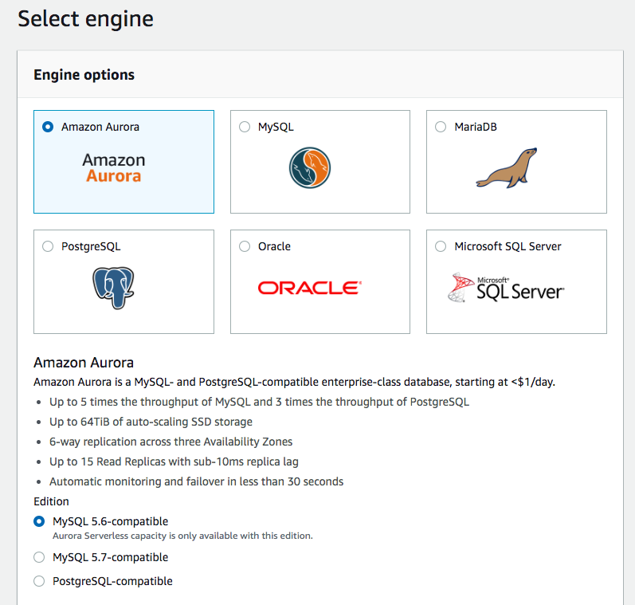

1. In the Capacity type section choose &quot;Serverless&quot;

    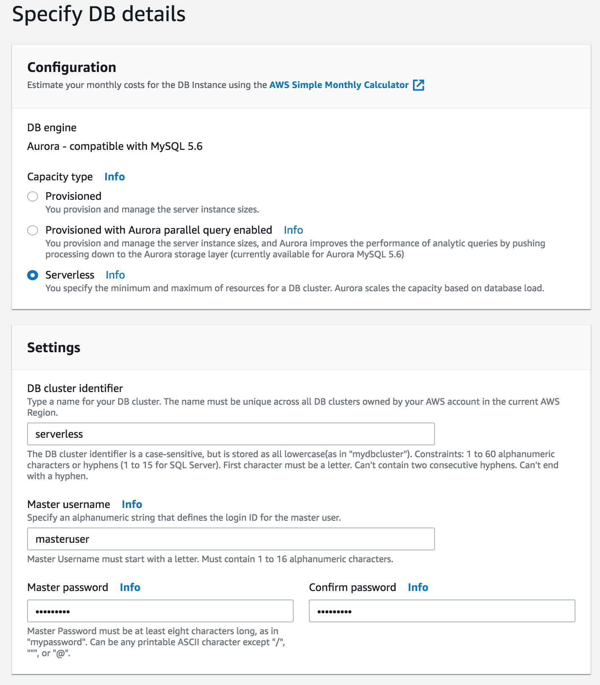

1. In the &quot;Settings&quot; section, give &quot;serverless&quot; as the cluster identifier, in &quot;Credentials Settings&quot;, leave &quot;admin&quot; as the username and choose a password that you can remember.

    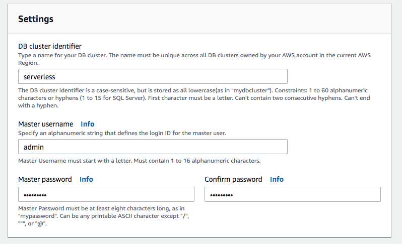


1. Leave the next sections as default and click on the create database button to create the database.

    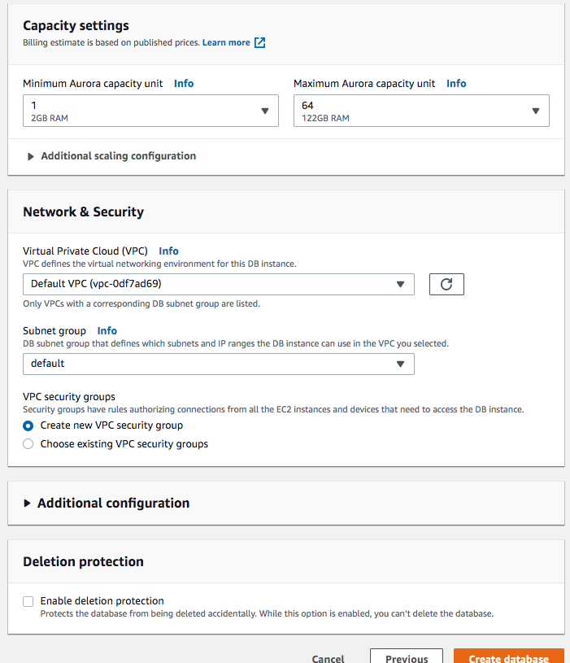


1. Once the Database cluster is created, we need to modify the instance for the purposes of enabling Data API for the given serverless instance. Select the database in the RDS console and click on "Modify"

    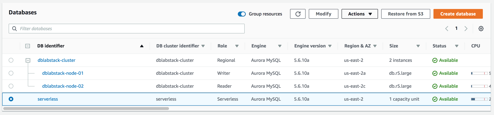


7. On the next screen in the &quot;Network and Security&quot;  section select the checkbox for &quot;Data API&quot; to enable it

    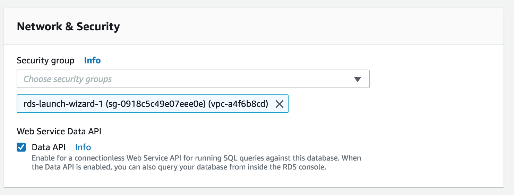


1. Select "Apply Immediately" and click on "Modify Cluster" on the next screen.

    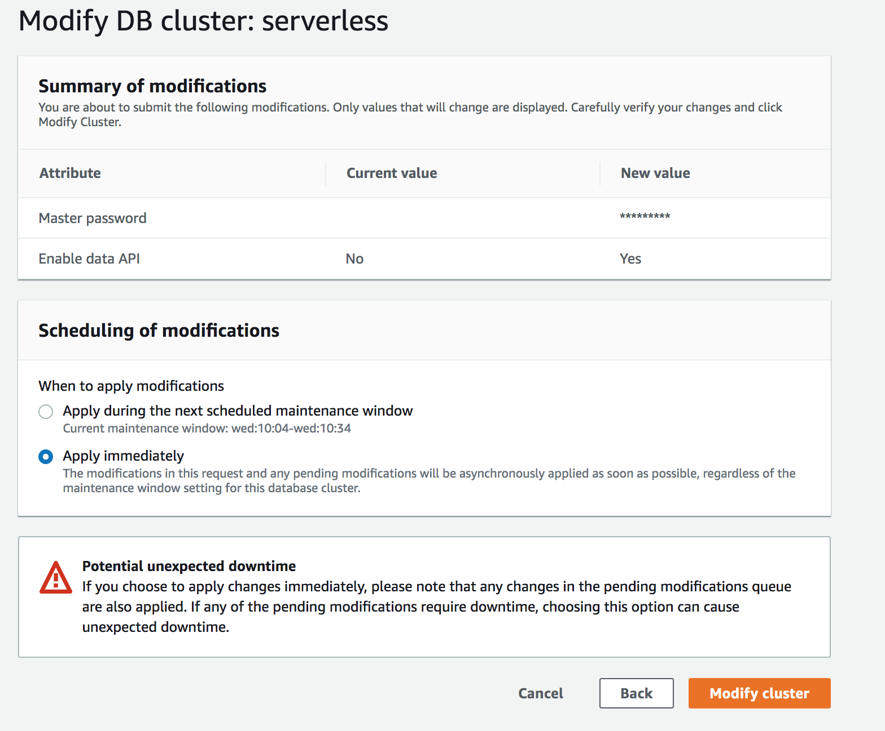

1. Next, we need to create a database and a table in the serverless database.
You can do this using the Query Editor on the console or any mysql client . Note the Query editor is currently only available for Aurora Serverless MYSQL.

    Navigate to the RDS Console and click on the Query Editor option on the left pane.
    On the following screen please select the following for the fields.

1. Select the database name from the dropdown ( in this case serverless)
2. Skip the next Field below Database username (i.e Add new database credentials). This is used in the event you want to create new users for the DB.

1. Enter `masterusername` in the "Enter Database username" field.
2. Enter the password provided at the time of  db creation. Skip the next field
    ("Enter the name of the database or schema") as you want to create a new DB and ciick on "Connect to database".

    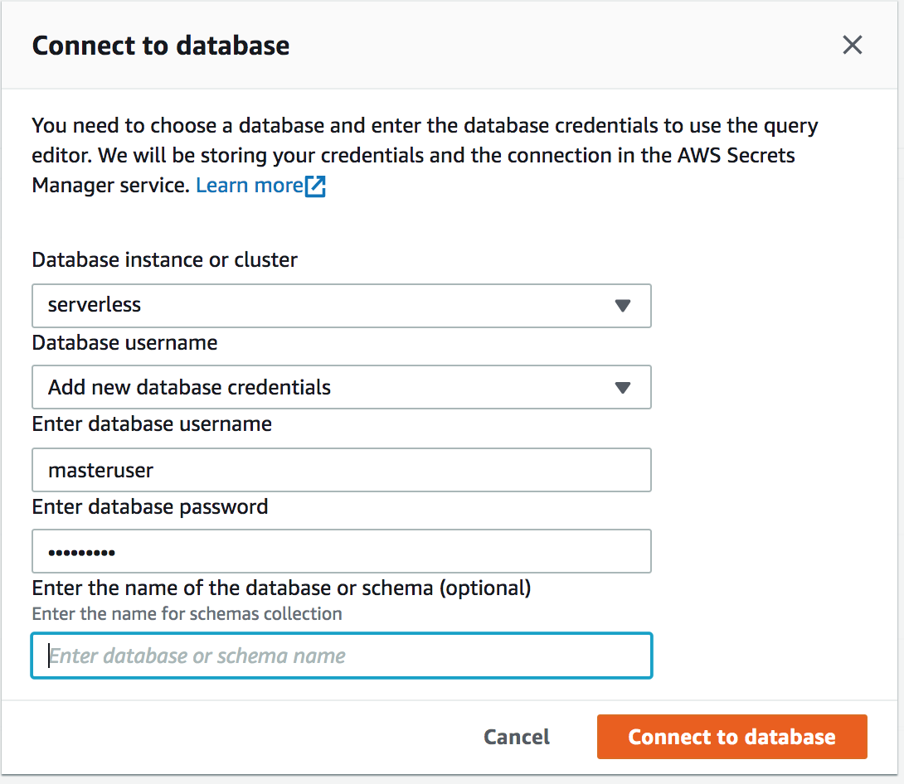


1. Remove ` and comment and Copy paste the below contents on the &quot;Editor&quot; Section of the next screen.

```
DROP DATABASE IF EXISTS employees;

CREATE DATABASE IF NOT EXISTS employees;

USE employees;

SELECT 'CREATING DATABASE STRUCTURE' as 'INFO';

DROP TABLE IF EXISTS employees;

/\*!50503 set default\_storage\_engine = InnoDB \*/;

/\*!50503 select CONCAT(&#39;storage engine: &#39;, @@default\_storage\_engine) as INFO \*/;

CREATE TABLE employees (
    emp_no  INT  NOT NULL,
    birth_date  DATE  NOT NULL,
    first_name  VARCHAR(14)  NOT NULL,
    last_name  VARCHAR(16)  NOT NULL,
    gender  ENUM ('M','F')  NOT NULL,
    hire_date  DATE  NOT NULL,
    PRIMARY KEY (emp_no)
);

SELECT 'LOADING employees' as 'INFO';

INSERT INTO `employees` VALUES (10001,'1953-09-02','Georgi','Facello','M','1986-06-26'),
(10002,'1964-06-02','Bezalel','Simmel','F','1985-11-21'),
(10003,'1959-12-03','Parto','Bamford','M','1986-08-28'),
(10004,'1954-05-01','Chirstian','Koblick','M','1986-12-01'),
(10005,'1955-01-21','Kyoichi','Maliniak','M','1989-09-12'),
(10006,'1953-04-20','Anneke','Preusig','F','1989-06-02'),
(10007,'1957-05-23','Tzvetan','Zielinski','F','1989-02-10');

```


1. The output tab below the editor will auto refresh as each SQL is executed.
    At the end of the last statement you should see the below SQL. Ensure status is reported as SUCCESS for all statements.

    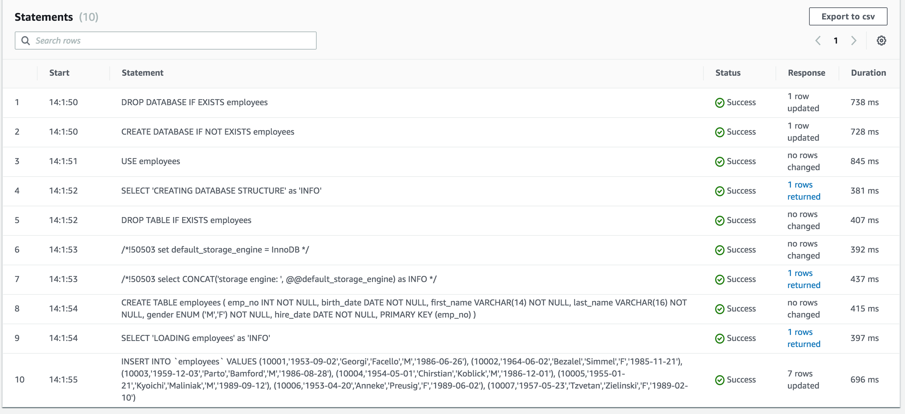


1. Create a Secrets to store the database credentials.
2. Go to the Secrets Manager Screen from the Services menu.
3. Click on the &quot;Store a new Secret&quot; button.

    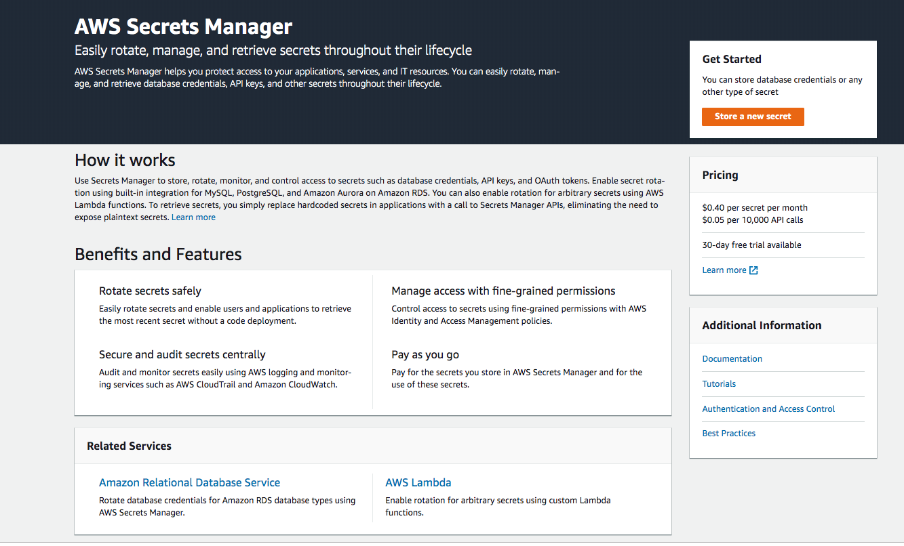


1. On the "Select a Secret Type" section, choose "Credentials for RDS Database", provide the Username and Password that you provided when you created the database.

    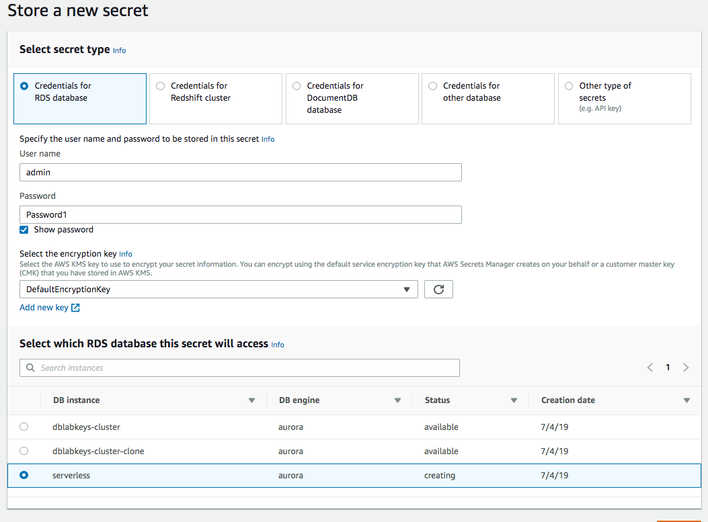

1. Choose the RDS Database that you created in the previous section and press the next button.
2. Give a friendly name and description and keep note of it, you will need it further down.

    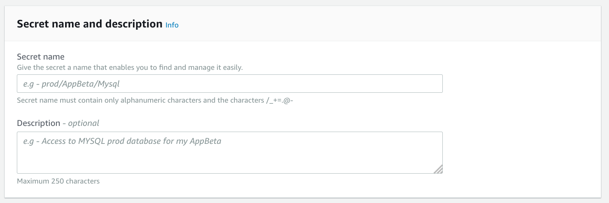

1. The next section is where you would create the "Automatic Rotation Policy" for this Lab we will leave those as default and press the "Next Button";

    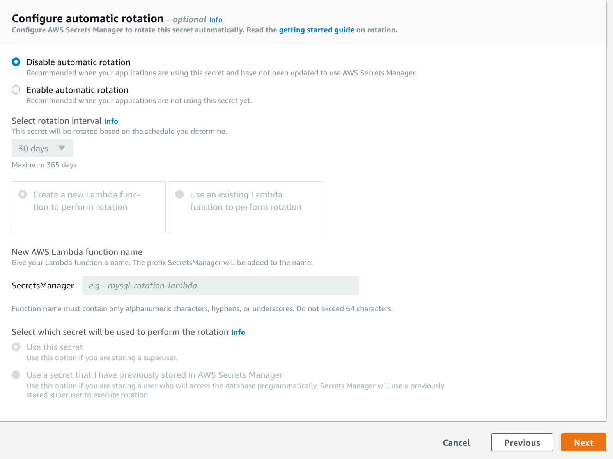


1. Review the details you have provided and click on "Store" to store the Key.
2. Navigate to the AWS Cloud 9 Service and click on "Create Environment";

    


1. Enter a name for the environment in the next screen, the description is optional.

    


1. In the following screen leave all the default values as is and proceed to the next step.

    


1. Review the settings and create your Environment. Once the environment is created your screen should look like this.

    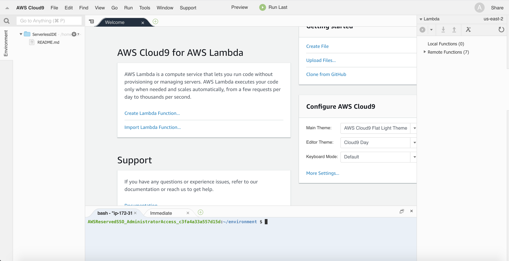


1. Click on the "Create Lambda Function" and enter Function Name in the next screen and click "Next"

    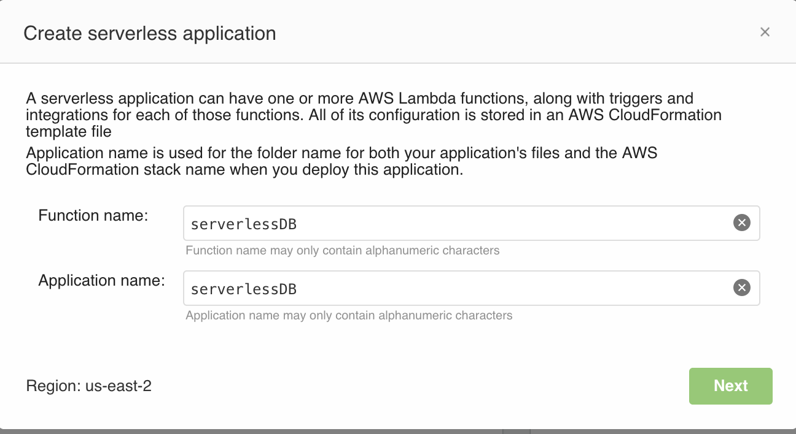


1. Choose Python 3.6 on the Runtime and use the "empty-python" as the blueprint and click "Next"

    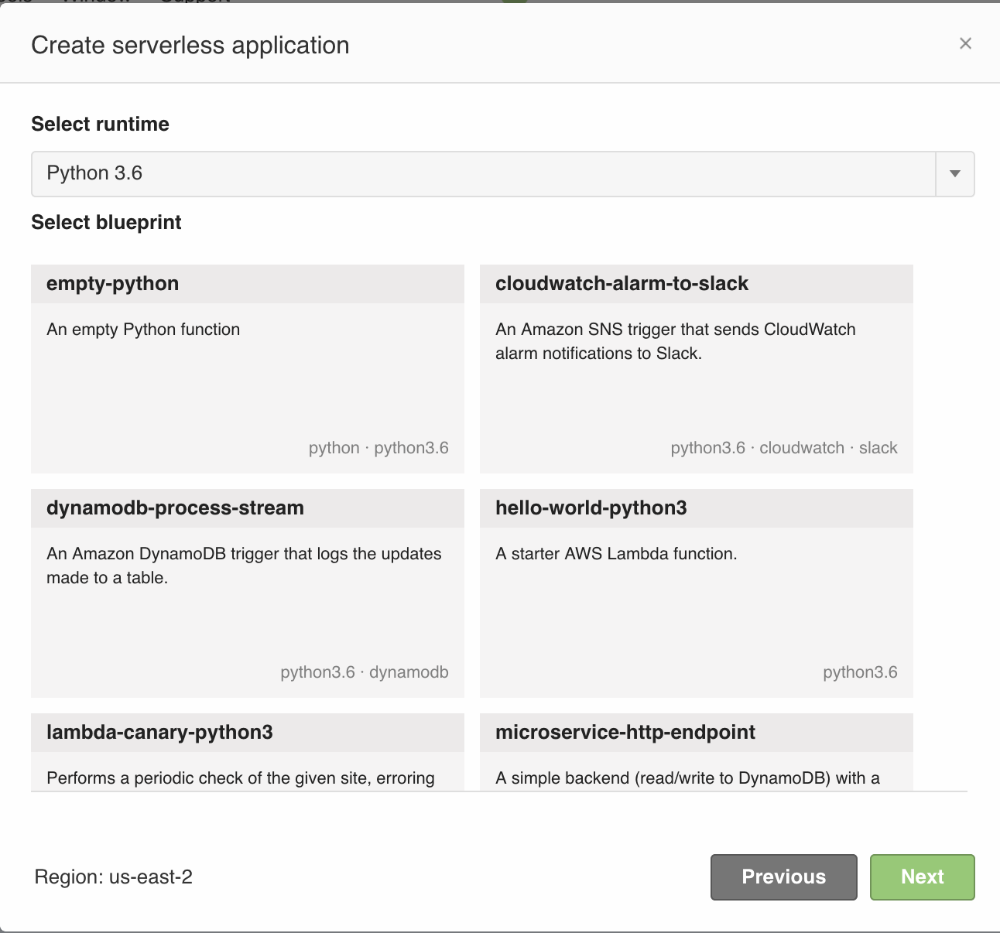


1. Choose "none" for the Function Trigger and press Next

    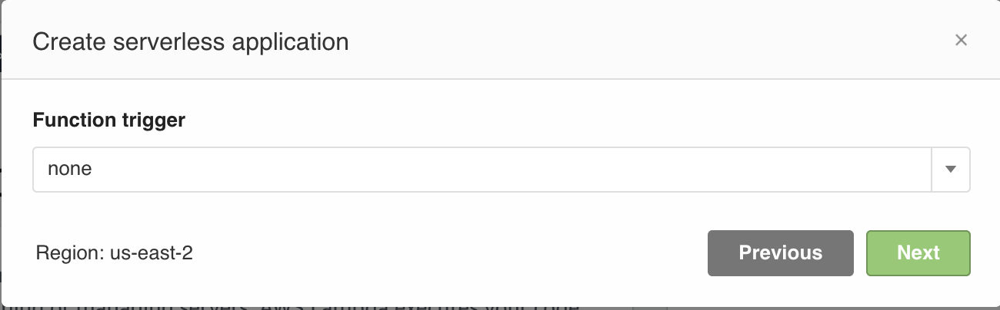


1. Leave the Memory and Role as default options

    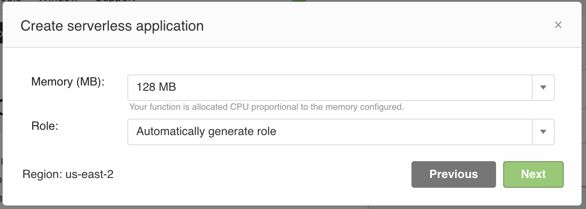


1. Your final screen should look something like the below

    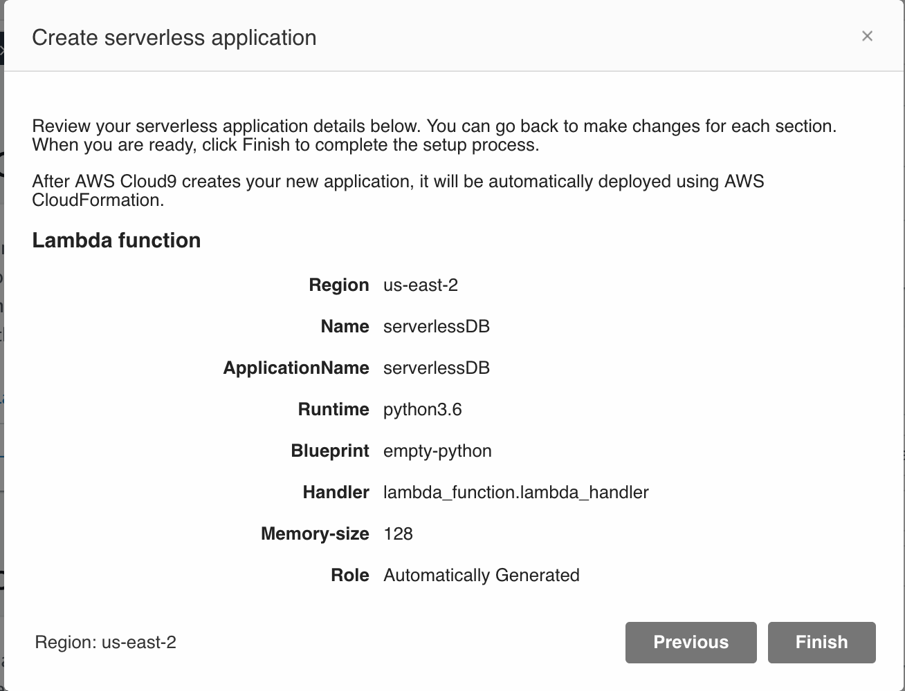


1. From the left side tree view, Click on serverless for drop down, then double click the requirements.txt file to open it. Add the following lines at the end of the file.

    ```
    awscli=1.16.193
    ```

1. Choose the Lambda function tab and copy the function downloaded from this URL - [https://pastebin.com/i2t3uaFr](https://pastebin.com/i2t3uaFr) or in [lambda_python.py](./lambda_python.py)

2. Use a text editor to replace the cluster_arn and secrets_arn variables from the previous steps. (at lines 6 & 7 )

1. Save the function.
2. In the bottom pane activate the virtual environment by using the command: `source serverlessDB/venv/bin/activate`

    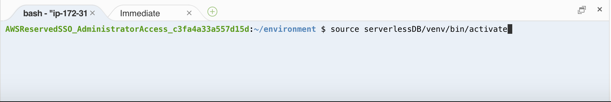


1. Change the directory to the "serverlessDB" and run the command: `pip install -r requirements.txt –target .`

    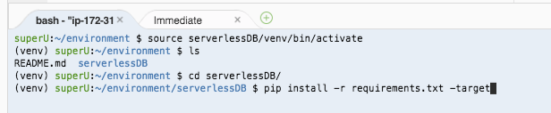


1. This will collect all the required packages and install them in the serverlessDB folder.

2. Once this is completed, you can click on the Run button to test the function locally. See the Tabs arranged horizontally on your right for this. Select serverless with lambda icon and right click to run

    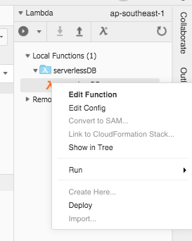


1. Select Run Local

    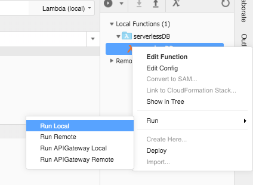


1. There is no Payload requirement and that can be left as default.

    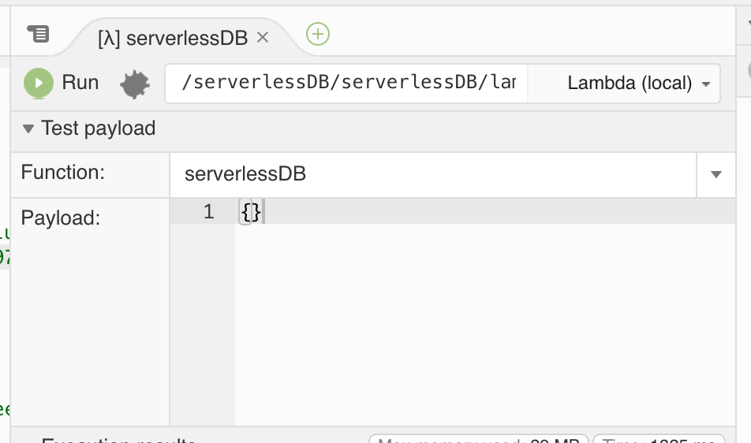


1. Once the function runs successfully, you will see response and function logs at the bottom pane.

1. You can deploy the function by right clicking on the local function and Deploying it.

    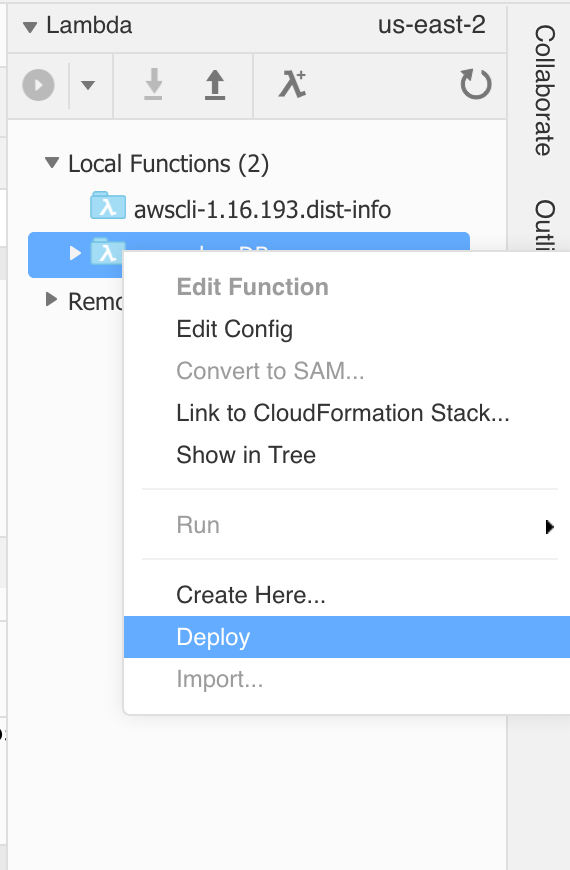


1. Once the function is deployed you will be able to see it in the "Remote Functions" tree

    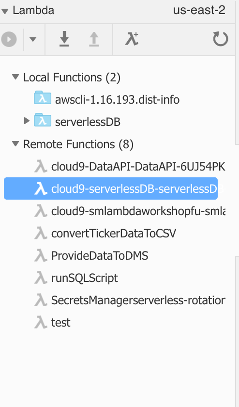


1. At this time, you can run this from the Lambda Console and even connect an API to the Lambda function.
